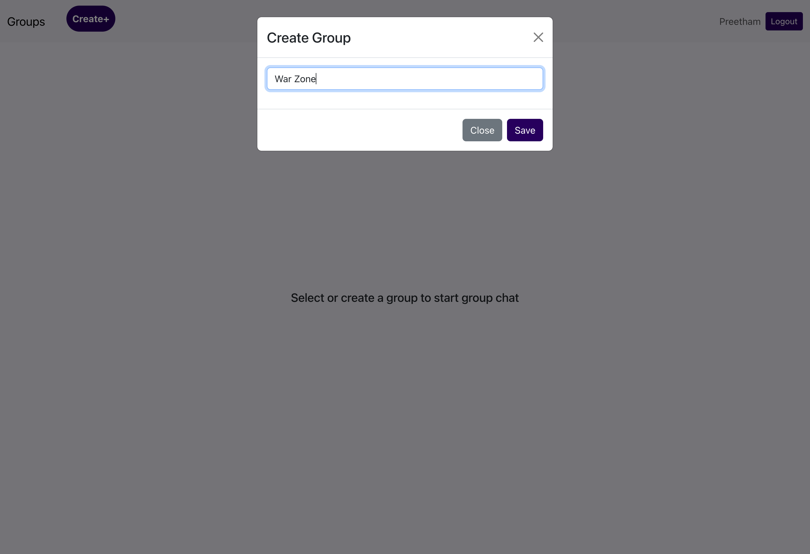
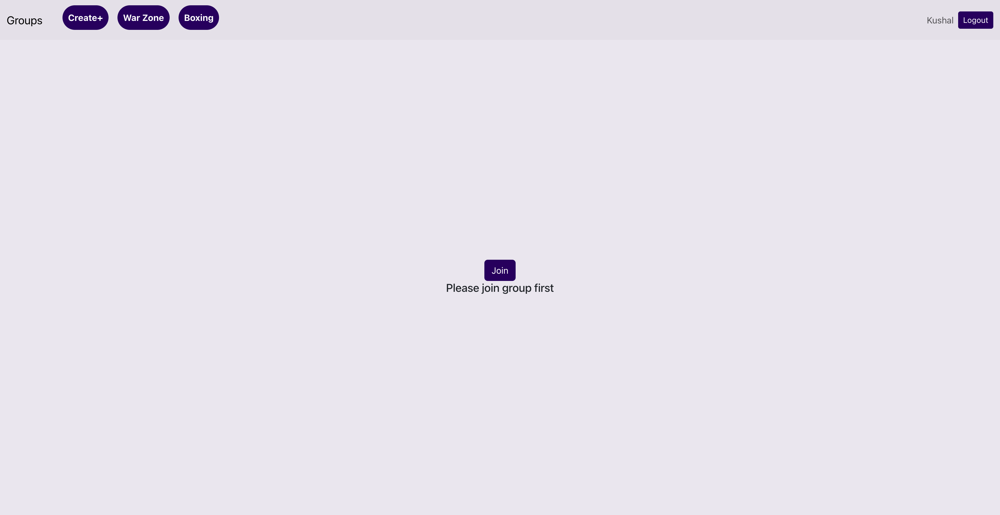

# Groupchat
This project is an assignment given to me as a part of interview process for Backend Developer position to test my Backend (also frontend) knowledge. I had to build a simple group chat application using Node and any frontend tech under given period (1 day). So this project is built as per that company specifications in interview (i can build a lot more better chat application than this :). You can download and run this and backend part (available in my git repo) to see how it works. Please remember that this is not a feature rich production ready project. Just an interview project. Below are some screenshots.

# Screenshots

## Login Page

## Main Page

## Creating Group

## Joining Group

## Join Request Status

## Join Request Accept or Reject

## Group Chat
